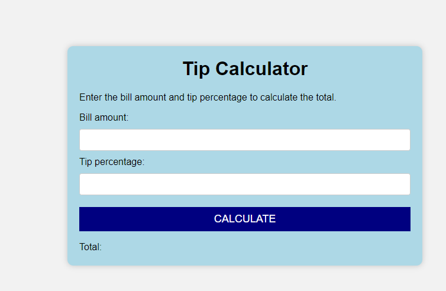
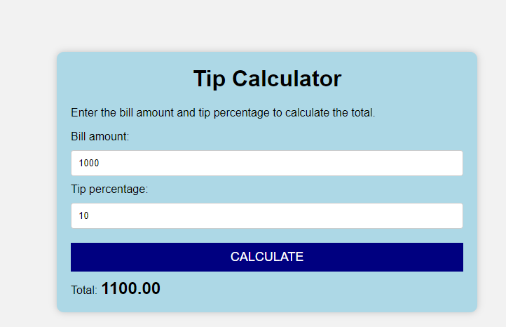

# Tip-calculator

## Description
The Tip Calculator Web App is a simple and intuitive application designed to help users calculate tips quickly and easily. Built with HTML, CSS, and JavaScript. The project's primary interface comprises a container labeled "Tip Calculator" with two input fields: one for the bill amount and the other for the tip percentage. The tip calculator has a modern design that is styled using CSS, utilized JavaScript to obtain the values of the two input fields and calculate the total amount based on these values.

## Prerequisites
N/A

## Technologies Used
Built with:
* HTML
* CSS
* JavaScript

## Installation
N/A

## Usage
N/A

## Project Link
Application can can be viewed here: 
* [Live](https://yvonnesarah.github.io/Tip-Calculator/)

* [Repository](https://github.com/yvonnesarah/Tip-Calculator)

## Screenshot(S)
Tip Calculator

Tip Calculator Example

## Credit
N/A

## Licence
Please refer to the LICENSE in the repo.